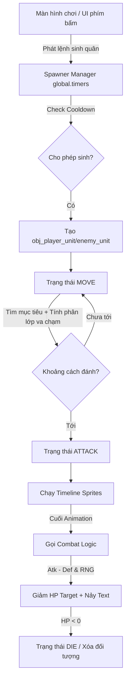

# Phân tích Dự án: Square & Circle (GameMaker Studio 2)

## 1. Tổng quan hệ thống
- **Mục tiêu hệ thống**: Xây dựng một mini-game dạng Tower Defense / Combat Simulation 2D, nơi người chơi và AI (Enemy) liên tục tạo lính để tấn công nhà (Tower) của đối phương.
- **Đối tượng người dùng**: Người chơi phổ thông yêu thích thể loại chiến thuật/phòng thủ tháp. Làm nền tảng/template cho đội ngũ phát triển mở rộng.
- **Các module chính**:
  - Quản lý Sinh lính (Spawner Manager)
  - Điều khiển Hành vi Lính (Unit AI & States Machine)
  - Xử lý Sát thương & Combat (Combat Logic)
  - Hệ thống Kế thừa Đối tượng (Unit/Tower Parent-Child Architecture)

---

## 2. Phân tích chức năng (Functional Breakdown)

### 2.1. Module: Quản lý Hình thành (Spawner Manager)
- **Tên Script/Object**: `src_spawner_manager.gml`, `obj_spawner`
- **Mô tả**: Xử lý logic sinh quân bằng phím bấm và kiểm tra thời gian hồi chiêu (Cooldown).
- **Chức năng chính**: Quản lý bộ đếm `global.spawn_timers`. Đọc phím bấm (1, 2, 3, 4 cho Player; Q cho Enemy) để tiến hành tính toán và sinh quái vào bản đồ.
- **Input / Output**:
  - Input: Phím chức năng từ người chơi (1-4, Q).
  - Output: Instance của lính (`obj_a_h_sworld`, `obj_e_orc_sworld`,...) và thiết lập vòng lặp hồi chiêu.
- **Quan hệ**: Tác động trực tiếp vào nhóm lính (Units) và tham chiếu vị trí của các `obj_tower`.

### 2.2. Module: Điều khiển Hành vi (Unit Function/AI)
- **Tên Script/Object**: `unit_function.gml`, `obj_unit_parent`
- **Mô tả**: AI di chuyển, tìm mục tiêu và ra quyết định đánh/chạy. Quản lý trạng thái (State Machine).
- **Chức năng chính**: Chuyển đổi trạng thái (MOVE, ATTACK, DIE). Nếu `MOVE`, đơn vị dùng thuật toán tự động tách nhau (Separation) để tránh đè lên nhau, đồng thời tracking đối tượng gần nhất. Dưới tầm đánh -> `ATTACK`.
- **Input / Output**:
  - Input: Vị trí của Unit hiện tại, vị trí của Unit đối phương hoặc Nhà.
  - Output: Tọa độ x, y thay đổi, Sprite thay đổi (như `spr_idle`, `spr_attack`).
- **Quan hệ**: Gọi `src_combat_logic` để trừ máu.

### 2.3. Module: Xử lý Sát thương (Combat Logic)
- **Tên Script/Object**: `src_combat_logic.gml`
- **Mô tả**: Tính toán máu, né tránh và hiển thị hiệu ứng tổn thương.
- **Chức năng chính**: Cho phép Né (Dodge roll), Tính toán Damage = (Atk - Def) * Biến thiên (90%-110%). 
- **Input / Output**:
  - Input: Biến của Kẻ tấn công (Atk) và Mục tiêu (Def, Dodge, Hp).
  - Output: Trừ `hp` của mục tiêu, sinh Object `obj_damage_text` thể hiện lượng sát thương, tạo hiệu ứng rung/nhấp nháy đỏ.
- **Quan hệ**: Được gọi từ `unit_function.gml` ở frame cuối của animation đánh.

---

## 3. Cấu trúc hệ thống
- **Cấu trúc thư mục định hướng GMS2**:
  - `/objects`: Tổ chức theo mảng kiến trúc kế thừa `Parent` -> `Player/Enemy` -> `Chi tiết Unit`.
  - `/scripts`: Phân tách các cụm chức năng ra riêng rẽ thay vì nhét hết logic vào *Step Event* (Cách code rất tốt để tái sử dụng).
  - `/rooms`: Nơi hội tụ logic của Game `Room1`.
- **Kiến trúc**: 
  - Kế thừa OOP (Object-Oriented): `obj_unit_parent` lưu toàn bộ Properties (Max HP, Atk, Def, Speed, Dodge...), các object con chỉ ghi đè (Override component).
  - Khởi tạo Data-Driven (Một phần): Sử dụng *Variable Definitions* (.yy files) thay vì code rác ở Create Event, giúp việc design chỉ số rất trực quan tại phần mềm.
- **Flow dữ liệu**:
  Input Người dùng -> Setup Timers (`obj_spawner`) -> Spawn `obj_unit` -> Vòng lặp `Step_0` gọi Script AI xử lý `MOVE/ATTACK` -> Check va chạm tầm nhìn -> Gọi Combat Handler (Trừ máu + Giao diện) -> Xóa đối tượng nếu `DIE`.

---

## 4. Database (Dữ liệu cố định)
- **Không sử dụng external Database (SQL/NoSQL) do bản chất là 2D client game.**
- Nhưng game lưu trữ "Database Thuộc tính" trên GMS2 Variables Form:
  - Bảng "Unit Properties": `max_hp`, `atk_damage`, `atk_range`, `atk_speed`, `move_speed`, `defense`, `dodge`, `spawn_time`, `cost`.
- **Nhận xét**: Tổ chức khá tốt nhưng thiếu khả năng phân loại "Armor Type" & "Damage Type" nếu muốn mở rộng mechanics (Ví dụ: Đâm xuyên giáp, phép thuật...). Số liệu đang hardcode ở dạng Float giản đơn.

---

## 5. API / Backend
- **Không áp dụng Client/Server API hiện tại.**
- Toàn bộ logic chạy cục bộ (Monolith Offline). Giao tiếp Data thông qua Global Space (như struct `global.spawn_timers`).

---

## 6. UI/UX
- **Các màn hình chính**: `Room1` (Sân đấu chính).
- **Luồng người dùng**: Nhấn bàn phím số -> Lính xuất hiện -> Xem quân tự đánh nhau.
- **Hiệu ứng UX / Trải nghiệm**:
  - Có *Screen Shake* và *bóp màu (Red Tint)* cho cảm giác combat có lực (Hit Feedback).
  - Có Damage Floating Text (chữ nảy lên).
- **Nhận xét**: Trải nghiệm cơ bản tốt, có yếu tố juice/game feel. Tuy nhiên chưa thấy phần UI hiển thị Máu của lính (Health Bar) hay CD thời gian sinh lính hiển thị trực quan (đang mù mờ với người test).

---

## 7. Vấn đề & Rủi ro

- **Code Smell (Magic Numbers)**: Hàm `clamp(y + _vy + _sep_y, 500, 760)` đang gắn cứng toạ độ bản đồ. Nếu màn hình chuyển tỷ lệ, lính sẽ chạy sai khu vực.
- **Hiệu suất thu phóng (Performance Risk)**: 
  Logic `target = instance_nearest(x, y, target_type)` nằm ngay trong `UNIT_STATE.MOVE` chạy **hàng frame (mỗi 1/60s) cho mọi units**. Khi giới hạn lính vượt quá 100-200 units, Game có thể bị sụt FPS nặng nề tốn chi phí $O(n^2)$.
- **Phụ thuộc phần cứng (Frame Dependent)**: Game đang sử dụng Time Scale cơ sở theo Frame (`Tốc độ khung hình = Thời gian`). `attack_timer--`, `spawn_timers[$ _n] -= 1`. Nếu máy tính giật lag -> Máy chạy chậm lại ảnh hưởng mạch game. Thiếu vắng *Delta Time* (delta_time multiplier).
- **Rủi ro cấu trúc Key Bind**: Điều khiển Spawn map cứng vào phím (1, 2, Q). Sẽ khó custom Settings cho người chơi về sau.

---

## 8. Đề xuất cải tiến

- **Ngắn hạn (Quick Fix)**:
  - Khắc phục Frame Performance: Không quét `instance_nearest` từng frame. Thiết lập một bộ đếm nhỏ (VD: Quét lại mục tiêu mỗi 15-30 frames hoặc khi đối tượng cũ bị destroy).
  - Thay số `500, 760` thành các biến phòng `room_top_bound`, `room_bottom_bound` hoặc reference vào một Object Ground thực thụ.
  
- **Trung hạn**:
  - Dòng máu/UI (Health Bars): Vẽ thẻ HP bar đơn giản phía trên lính trong sự kiện `Draw_0`.
  - Nút bấm trực quan (Action UI): Làm các Icon clickable thay vì chỉ bắt sự kiện Keyboard, giúp game porting lên di động dễ dàng. 

- **Dài hạn (Refactor / Redesign)**:
  - Delta Time Setup: Chuẩn hoá hóa tất cả Biến đếm (Timer) và Vận tốc (Velocity) qua `delta_time` thay vì -1 theo Step Frame.
  - Object Pooling: Tái sử dụng `obj_damage_text` và Units cũ (Pop/Push) vào mảng rác thay vì `instance_create` và `instance_destroy` liên tục để giảm tải RAM Collector của Gamemaker.

---

## 💡 Bonus: Blueprint Kiến trúc & Checklist

### 📐 Sơ đồ kiến trúc (Flow)

### ✅ Checklist năng suất (Nâng cấp bản build tới)
- [ ] Rework hệ thống quét mục tiêu `instance_nearest()` theo chu kỳ (Tick).
- [ ] Thêm biến `ymin`, `ymax` dạng global thay cho giá trị cố định `500`, `760`.
- [ ] Xây dựng Object Controller vẽ UI và quản lý thao tác chuột (Spawn bằng thao tác chạm/click).
- [ ] Nâng cấp Component "Unit Properties" thêm kiểu sát thương (Melee, Range, Magic).
- [ ] Viết script dọn rác (Pool) hoặc tự động huỷ bỏ chữ sát thương ngoài rìa màn hình.
